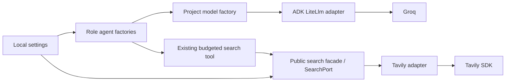

# Provider-Neutral Research Foundation — Design

## 1. Evidence and current architecture

Planning on 2026-10-07, branch `planning/provider-neutral-research-foundation`,
HEAD `63df1b90ef9f6675817c683fc80e394aa1a955e9`, initially clean. Read all
tracked application/test/spec files, README, packaging, Task 000 and harness.
The repository, not wider historical aspirations, defines deployed behavior.
System `python scripts/verify.py` initially failed because pytest was absent.
The existing `.venv` resolves it without installation: Python 3.14.3,
verification exit 0, 62 tests, Ruff passed, two existing warnings (Google GenAI
deprecation and pytest cache write). Activate it before canonical commands.
Python floor remains 3.11. Pins remain ADK 2.10.0, LiteLLM 1.101.2 and Tavily
0.8.4; pytest/Ruff already exist. No dependencies or packaging changes planned.

| Actual component | Responsibility/coupling | Existing protection |
| --- | --- | --- |
| `app/research_planner/agent.py` | ADK root agent plans only; no tools. Module-level `MODEL = LiteLlm(...)` hardcodes Groq route and reasoning flag. | `tests/test_research_planner.py`: configuration, grounding, output sections, unsupported specificity. |
| `app/research_agent/agent.py` | Separate ADK root agent researches one thread; duplicates model hardcode. No automatic planner-to-researcher orchestration. | `tests/test_research_agent.py`: identity/model, tool/callback, output and strict grounding prompts. |
| `app/research_agent/tools.py` | Already good normalized retrieval consumer; ADK contexts, JSON serialization, safe outcome mapping, two-slot lock/state budget. | Delegation, query-only schema, exact payload, empty/error, reset and concurrent reservations in `test_research_agent.py`. |
| `app/source_retrieval/service.py` | Good public query/options facade, but also reads Tavily key, constructs SDK client, maps depth and parses raw results. Legacy `client=` is an SDK fake seam. | `tests/test_source_retrieval.py`: options, input before call, key before construction, normalization, URLs, duplicates, malformed data, empty/timeout/provider errors. |
| `app/source_retrieval/models.py` / `errors.py` | Provider-neutral frozen dataclasses and project exceptions; preserve public imports. `provider_metadata` intentionally opaque. | Retrieval assertions and serialized research-tool assertions. |
| Package entry points | Planner `__init__` exports `agent`; researcher exports `root_agent`; `app.__version__` is 0.1.0. | `test_app.py` plus direct agent import tests. |

`knowledge/` and `evals/` are placeholders, not a corpus/evaluation system.
TMDB key in `.env.example` is unused; no TMDB behavior is implemented.
No separate plan/thread Python models, persistence, source inspection or final
dossier exists. Historical spec 001 describes a broader destination, including
source classifications: those are deferred. Specs 002–004 and hardened prompts
define today's planning/discovery constraints and take precedence for this stage.

Current subtle limits: Tavily constructor exceptions occur outside the request
try block; model failures are not normalized by the project; tests for Groq
inspect a private LiteLlm argument; architecture tests only search strings for
direct Tavily coupling; prompt tests cannot prove generated claims are grounded.
The existing SDK normalization does not enforce an extra post-response result
cap or type-check trace metadata; do not add such semantic changes in a refactor.

## 2. Decision and target dependency direction

Keep Google ADK as agent framework, its tool/context lifecycle and `BaseLlm`
contract. Keep LiteLLM as transport translator, and Groq as first real model
provider. Keep Tavily SDK as first real search provider. Provider neutrality
means project agents select capabilities through composition, not that the
project becomes independent of ADK in this stage.



Agents own responsibility/instructions and ADK configuration only. Model
transport/routing/errors live in `app/model_runtime/`. Retrieval service owns
input validation, composition and the public facade; its adapter owns raw SDK
behavior. Data/errors/ports/configuration do not import providers or agents.
Adapters never import research agents. The search tool remains unchanged.

| Proposed file | Responsibility |
| --- | --- |
| `app/config.py` | Frozen settings, defaults, TOML loading, safe configuration errors. No SDK. |
| `app/model_runtime/__init__.py` | Public `build_model`, `ModelExecutionError` exports. |
| `app/model_runtime/errors.py` | Safe model error contract, no SDK. |
| `app/model_runtime/litellm.py` | Model factory and private thin LiteLlm subclass; routing, key preflight, execution error translation. |
| Existing two `agent.py` files | Add injectable `build_agent`; preserve root imports and exact instructions. |
| `app/source_retrieval/ports.py` | One structural `SearchPort`, returning existing normalized values. |
| `app/source_retrieval/adapters/{__init__,tavily}.py` | Tavily implementation and moved normalization. Empty package initializer. |
| Existing retrieval `service.py` | Validation, injection precedence, default adapter selection. |
| Existing retrieval `__init__.py` | Keep exports; additionally expose `SearchPort`. |

No common adapters superclass, provider registry, dependency container,
configuration singleton, import-time network call, or project request/response
copy of ADK is needed. `LanguageModelPort` is rejected: it would duplicate
`BaseLlm` and force an extra tool-call/stream conversion. `SearchPort` earns its
place because it replaces the raw Tavily-client seam with normalized injection.
DocumentReaderPort, EmbeddingPort and RerankerPort have no current consumer and
are explicitly deferred.

## 3. Configuration contract

Use stdlib `tomllib` (Python >=3.11). Defaults are declared once in
`app/config.py`, not copied into agents. No file required for today's behavior,
no package data/install changes. `FILM_RESEARCH_CONFIG` optionally selects a
local TOML file. Do not read `.env` directly; ADK/the user's launcher owns env
loading as before. Credentials remain `GROQ_API_KEY` and `TAVILY_API_KEY` in
the process environment, read only by the relevant adapter.

Public Python shapes (signatures are contracts, no implementation supplied):

- Frozen `ModelConfig(provider: str, model_id: str, model_family: str | None = None,
  include_reasoning: bool | None = None)`.
- Frozen `RuntimeConfig(research_planner: ModelConfig, research_agent: ModelConfig,
  search_provider: str = "tavily")`.
- `RuntimeConfig.model_for(role: str) -> ModelConfig`: exactly
  `research_planner` and `research_agent`; any other role raises `ConfigurationError`.
- `ConfigurationError(ValueError)` with no-argument constructor: fixed message
  `Invalid research runtime configuration.`; no echoed file content, paths,
  unknown values, credential values or SDK payloads. Suppress underlying file/
  parser exception display with `from None`.
- `load_config(path: str | Path | None = None) -> RuntimeConfig`.
- `DEFAULT_CONFIG: RuntimeConfig` with both role fields referencing the same
  immutable default model: provider `groq`, model_id `openai/gpt-oss-120b`,
  model_family `gpt-oss`, include_reasoning `False`; search_provider `tavily`.

Role is the responsibility key. `model_id` is the provider's identifier and may
contain an owner namespace (`openai/` here); that namespace is not the provider.
`model_family` is optional descriptive metadata, not a model catalog or routing
decision. Do not infer provider from family or model ID, or family from role.

Example explicit profile, to be documented in README (not a required file):

```toml
[roles.research_planner]
provider = "groq"
model_id = "openai/gpt-oss-120b"
model_family = "gpt-oss"
include_reasoning = false

[roles.research_agent]
provider = "groq"
model_id = "openai/gpt-oss-120b"
model_family = "gpt-oss"
include_reasoning = false

[search]
provider = "tavily"
```

Precedence: explicit `path` > nonblank `FILM_RESEARCH_CONFIG` > defaults.
A set-but-blank environment path is an error, not absence. Relative paths
resolve against cwd; explicit paths never fall back to env/default on failure.
No global cache: callers get a fresh validated snapshot (returning immutable
defaults is allowed). TOML top-level keys only `roles`, `search`; both optional.
Unknown keys/role names, non-table sections, malformed/unreadable files fail.
An absent role uses the whole default binding. A present role table requires
`provider` and `model_id`; no per-field merge of defaults. Optional family and
reasoning default to `None` within a present binding. `[search]` requires
`provider` if present. Empty file uses defaults; empty present role/search
tables fail. No generic kwargs or API keys in TOML.

Strings must be nonblank and already trimmed. Provider identifiers must match
`[a-z][a-z0-9_]*`; model IDs must be printable strings without any whitespace
(`isprintable()` and no character satisfying `isspace()`), and are not restricted
to a catalog. Family, when supplied, is a nonblank trimmed string.
`include_reasoning` is exactly bool or None for Python injection; numbers and
strings are rejected. Frozen dataclass construction validates the same field
rules as TOML. RuntimeConfig verifies both model bindings and search identifier.
Unsupported syntactically valid providers are rejected at capability selection,
before SDK construction/calls, not silently mapped to Groq/Tavily.

Factories accept explicit settings for comparisons without process-env edits.
Imported `root_agent` is a startup snapshot; changing a file/env later requires
restart or explicit factory construction. The default retrieval facade loads
settings per operation unless a client/searcher is explicitly injected; there
is no promise of dynamic consistency across an already-built agent and later
search calls. Comparative harnesses should pass settings/models explicitly and
use the search facade's searcher seam. No comparison runner is built now.

## 4. Model boundary and errors

`build_model(selection: ModelConfig) -> google.adk.models.base_llm.BaseLlm`
is exported from `app.model_runtime`. Only `groq` is implemented. Reject any
other provider with ConfigurationError before construction. For Groq, reject
model IDs already beginning `groq/`; compose exactly `groq/{model_id}` in this
adapter. The owner namespace is retained. Changing model_id is allowed without
a hardcoded allowlist; compatibility/tool support is not guaranteed by syntax.
Pass `include_reasoning` only when non-None. Family never reaches SDK kwargs.
No custom endpoints, fallback chain, retries, routing catalog or native Groq SDK.

Private `_ProjectLiteLlm(LiteLlm)` keeps LiteLlm serialization/capabilities and
the full ADK request/response contract. Override only
`generate_content_async(self, llm_request: LlmRequest, stream: bool = False)
-> AsyncGenerator[LlmResponse, None]`. Delegate to `super()` and yield unchanged
responses for both streaming modes, including usage and function calls. Do not
parse prompts/tools or buffer/reconstruct responses. No request-level route
override policy is introduced; ADK's current request behavior remains intact.
Construction/imports do not require keys or perform completion calls.

At iteration start preflight nonblank `GROQ_API_KEY`; no fallback/keyless mode.
Raise `ModelExecutionError("Model credentials are required.",
category="missing_credentials")` before generation when absent/blank.
LiteLLM continues consuming the env key; do not store it in
settings, model dataclass fields or logs. During the delegated generation,
translate `Exception` to `ModelExecutionError`; this includes unexpected
runtime/conversion failures rather than exposing raw backend objects. It is a
model-execution failure, not proof of a failed external HTTP request.

`ModelExecutionError(Exception)` has constructor
`(message: str, *, category: str = "provider")`; adapter emits only fixed
messages and categories below. No SDK imports in `errors.py`.

| Condition | Category | Fixed message |
| --- | --- | --- |
| Missing/blank key preflight | `missing_credentials` | `Model credentials are required.` |
| Builtin TimeoutError or LiteLLM Timeout | `timeout` | `Model execution timed out.` |
| LiteLLM AuthenticationError | `authentication` | `Model authentication failed.` |
| LiteLLM RateLimitError | `rate_limit` | `Model rate limit reached.` |
| Other Exception from delegated generation | `provider` | `Model execution failed.` |

Classify by exception types from pinned `litellm.exceptions`, never provider
message text. Public data is the fixed message and category only; do not copy
raw message, request, headers or response. Suppress underlying exception display
with `raise ... from None`; Python may retain implicit exception context
internally, which must not be serialized. Do not copy SDK exceptions into
public fields or log them. Preserve an already
raised ModelExecutionError. Do not catch BaseException: cancellation,
KeyboardInterrupt, SystemExit and generator close propagate.

A failure after partial responses propagates a terminal project error; emitted
partials remain partial, no fabricated success or replay, no automatic retry.
This is an exception visible to ADK/caller, not an invented research result or
search-tool status. No runner/UI exists to translate it further in this scope.
ADK/library diagnostic logging is outside this project-error redaction guarantee;
project code must not add raw logging. Existing retrieval chaining is discussed
separately below, not silently changed to match model errors.

Tests use `asyncio.run` and patch LiteLlm's generation with async generators,
including response sentinels and actual LiteLLM exception objects. No async
pytest dependency. Also construct the real adapter offline and prove its route
and constructor kwargs; `_additional_args` inspection is confined to that test,
no production dependence on the private attribute.

## 5. Agent composition and compatibility

Add to each existing agent module:
`build_agent(config: RuntimeConfig | None = None, *, model: BaseLlm | None = None)
-> Agent` (BaseLlm is the existing neutral ADK contract).
Explicit `model` wins and bypasses config loading/model selection; otherwise use
explicit config, or load_config(), then model_for(the constant responsibility)
and build_model(). No agent-local provider branches or model IDs.

Keep PLANNER_INSTRUCTION and RESEARCH_AGENT_INSTRUCTION byte-for-byte identical.
Keep name/description, planner's empty tools, researcher's `[search_web]` and
before_agent_callback `reset_search_budget`. No provider/model information in
research output or prompt. Preserve package entry points unchanged.
At module end construct `root_agent = build_agent()` once and retain existing
`MODEL = root_agent.model` as a compatibility alias; do not construct two models.
Factories create independent agent/model instances on each ordinary call.
Explicitly reused fake/model objects may be shared at caller discretion.

Existing default-model assertions remain under a controlled default environment;
clear FILM_RESEARCH_CONFIG before agent imports rather than relying on user env.
Move the planner test's collection-time agent import into tests under a fixture
that clears the profile env; retain all assertion meanings. To test explicit
model precedence with an invalid env path, first import the module under valid
defaults, then set the invalid env and call the already-imported factory.
An invalid startup profile intentionally fails eager root construction.
Add independent per-role configuration and fake
BaseLlm injection tests. Research tool signature/schema, state key
`temp:research_agent_search_calls`, lock, constants (2/3), error statuses and
serialization do not change. Existing tool code needs no refactor.

## 6. Search capability and Tavily adapter

Export `SearchPort` from `app.source_retrieval`, defined using typing.Protocol
in `ports.py`, with one method:
`search(self, query: str, *, max_results: int = 5, search_depth: str = "standard")
-> RetrievalResult`. No runtime_checkable requirement or inheritance for fakes.
Port calls receive already validated/trimmed query/options from service.
Implementations return existing dataclasses or raise existing project errors;
no raw response/SDK exception crosses this contract. Opaque provider_metadata
remains provider attribution, not a reason for consumers to parse raw envelopes.
No second normalized result/request model.

Extend facade to:
`search_web(query: str, *, max_results: int = 5, search_depth: str = "standard",
client=None, searcher: SearchPort | None = None) -> RetrievalResult`.
`client` retains its original meaning: legacy Tavily SDK client injection. It
does not become a generic provider client. Consumers should prefer `searcher`.
Do not emit a deprecation warning or remove client in this stage.

Flow and precedence:

1. Existing input validation first (even before injection/config selection).
   Keep defaults, bool rejection, range 1..10, `standard`/`deep`, whitespace trim.
2. Both non-None client and searcher: InvalidRetrievalInputError with fixed
   message `client and searcher are mutually exclusive.`; neither is invoked.
3. Explicit searcher: delegate normalized input/options directly; no config,
   credentials or Tavily construction. Project errors pass through unchanged.
4. Explicit client: wrap with TavilySearchAdapter(client=client); bypass config
   and credentials, matching today's fake-client path.
5. Neither: load_config(), require search_provider `tavily`, construct adapter
   and delegate. Translate configuration loading/unsupported selection errors
   to ProviderError(`Source retrieval configuration is invalid.`,
   category=`provider`) from None. This preserves existing safe tool statuses;
   the direct config/model factory still raises ConfigurationError.

No global provider registry or setter. Default settings may be injected by
patching the loader in tests; normalized fakes use searcher directly. A later
search provider adds its adapter and this one composition selection branch,
without touching agents or candidate/error models. Config structure needs no
new dimension; support validation is owned by the selected capability.

`TavilySearchAdapter(*, client=None)` has no network/key work in its constructor;
`search` constructs a client lazily when needed, after service validation. Move
existing raw normalizers, depth map and timeout helper into `adapters/tavily.py`.
Keep the following exact behavior:

- Public `standard` -> SDK `basic`, `deep` -> `advanced`, include_answer False.
- Valid mapping envelope with list `results`, else MalformedProviderResponseError.
- HTTP/HTTPS with parseable host and no surrounding whitespace, URL preserved
  exactly (no canonicalization); hostname derived mechanically.
- Provider order, exact-URL deduplication retaining first. Distinct URLs stay
  distinct. Positions are one-based original result positions; duplicates
  produce no new warnings, matching deployed code.
- Non-string title/content are None. `result_id` beats `id`; `score` maps to
  `relevance_score`; published_date, request_id and response_time retained as
  currently supplied. No extra metadata sanitizer/cap/reliability classifier.
- Malformed individual items omitted with existing warning type, position and
  message; malformed envelope fails; empty list is successful empty result.
- Missing/blank TAVILY_API_KEY fails before SDK construction. Even if SDK can
  operate keyless, the project must retain its explicit-key policy.

## 7. Retrieval error semantics

Keep existing class identities/exports: SourceRetrievalError,
InvalidRetrievalInputError, MissingCredentialsError,
MalformedProviderResponseError and ProviderError(category="provider"|"timeout").
Keep current safe messages and timeout classification (builtin TimeoutError
or type name containing timeout); do not introduce retry/auth/rate categories
that would change research-tool behavior.

Wrap both SDK creation and SDK search with the provider exception translator.
Key preflight remains outside that SDK try block so MissingCredentialsError
is not flattened. Normalize only after successful SDK return so malformed
envelope errors are not flattened either. Request/constructor failures get
the same current timeout/provider messages. Preserve SDK cause internally
as today (`from exc`), but public str/category and tool payload never serialize
it. No additional raw logs. This intentionally closes the constructor gap
without redesigning established error meanings.

| Internal condition | Tool payload status | Additional safe field |
| --- | --- | --- |
| Nonempty normalized candidates | `ok` | Existing trace, warnings and budget |
| Empty success | `empty_result` | Existing empty result and budget |
| Invalid input / conflicting injection | `invalid_input` | No error details |
| Missing key | `missing_credentials` | No error details |
| Request/constructor/configuration failure | `provider_error` | category `timeout` or `provider` |
| Bad envelope | `malformed_response` | No error details |
| No third slot | `search_budget_exhausted` | calls_used=2, remaining_budget=0 |

No new tool statuses. Failed/empty attempts consume a slot. The adapter never
performs a model call, source inspection or fallback. Invalid normalized fakes
are contract violations, not a provider-response parsing feature; do not build
a second validator for injected output. Test fakes must obey the contract.

## 8. Testing and architecture enforcement

Keep the existing 62 parametrized cases' behavior. Test movement/monkeypatch
target updates are permitted when implementation moves; do not delete coverage
or weaken values/prompt assertions to make a migration pass. In particular,
TavilyClient patches move from service to adapters.tavily. Default tests must
control config env so the suite is independent of a developer's profile.

| Owned tests | Minimum meaningful cases |
| --- | --- |
| `tests/test_config.py` (001) | Immutable defaults, role separation, TOML/precedence/whole-binding replacement, strict validation, safe errors, env/files and cwd behavior. |
| `tests/test_model_runtime.py` (002) | Correct route/options, family not routing, unsupported provider/double prefix, no key at construction, async passthrough/errors/cancellation/partial stream. |
| Existing agent tests (003) | Original assertions plus explicit model and settings, independent roles/instances, root imports and MODEL alias, no implicit loader when injected model used. |
| `tests/test_search_adapters.py` + retrieval tests (004) | Normalized fake contract, legacy path, conflicting injections, identical Tavily normalization/options, constructor failure translation. |
| Retrieval tests (005) | Config-selected default path, unsupported/malformed config safe failure, injections bypass env, input-before-config/provider. |
| `tests/test_architecture.py`, `tests/test_provider_neutral_flow.py` (006) | AST constraints with violating snippets, offline entry-point/fake composed run covering warnings/errors/budget and independent models. |

Use existing pytest and stdlib AST/pathlib/asyncio, no new frameworks. Static
tests scan imports recursively (including aliases and local imports) and string
literals for exact restricted names, not text occurrences in prompts/comments.
Rules:

1. Provider SDK roots `tavily`, `groq`, `litellm`, `openai`, `google.genai` only
   in designated adapters (litellm/openai in model adapter; tavily in its
   adapter). No native Groq SDK is actually used. Concrete ADK LiteLlm import
   only in model adapter. Agent modules may import Agent, contexts and BaseLlm.
2. Config, retrieval models/errors/ports and model errors have no provider SDK,
   agent or runtime adapter imports. Retrieval service may compose Tavily
   adapter; no LLM/agent dependency there or in retrieval adapter.
3. Model adapter may not import agent/retrieval packages. Agents cannot import
   concrete adapters, read provider keys or contain `groq/` model-route literals.
   Tavily mention in unchanged grounding prose is allowed.
4. Groq/Tavily key-name literals only in their adapters; model default binding
   only in config. Ban exact default model_id/route literals elsewhere in app.
   Tests/README/example env are outside this application rule.

A small AST helper within the test file returns violations; test it against
at least forbidden aliased SDK import, a local import, model route literal and
allowed ADK/context/grounding content. No production linter/plugin machinery.
Explicit dynamic imports/bypass are prohibited by review; AST is a guard, not
a security sandbox or full dependency graph resolver.

The final offline flow blocks socket connections and live LiteLLM completion
entry points while constructing agents and invoking the real research tool;
record attempted calls and assert zero even if a library suppresses the guard's
exception. A read-only probe of today's fresh default imports already succeeded
without keys/profile and with zero socket attempts; preserve this property.
Use fake BaseLlm plus patched public facade delegating to a real search facade
with normalized fake searcher. Save the original facade before monkeypatching
to avoid recursion. Prove candidate/query/trace/warnings/JSON payload unchanged,
both roles independently built, failure/empty slot consumption and third-call
block; existing race test remains the concurrency proof. Also import default
root agents with keys/config env cleared under the network guard. No ADK runner,
inference-quality assertion or live smoke test is required for DONE.

## 9. Incremental migration and integration

Six packets: 001 configuration; 002 model runtime; 003 compose agents; 004
search contract/adapter extraction; 005 configure default retrieval; 006
enforce architecture and composed offline compatibility. 001 and 004 have no
new prerequisites; 001 is the recommended first READY packet. Until 003,
existing agents still work; until 005, retrieval still defaults directly to
Tavily. Each stage preserves imports and public tests and is independently
reviewable. Reverting the latest increment preserves its predecessor; reverting
a foundation after dependents requires reverting those dependents too.

Every Executor runs baseline and final `python scripts/verify.py`, targeted
tests, diff/whitespace/scope review and updates only its own record/progress.
Task 000 outputs are present in this planning checkout; no new packet depends
on an unimplemented scaffold. Task statuses in the DAG are planning snapshots.
Only the Planner/user promotes PENDING after dependencies are DONE AND their
outputs integrated into updated develop. Never implement an absent dependency.
User first integrates these planning documents through the planning PR, then
creates each task branch from that develop; DONE is local verification, not
integration. No automatic branch, commit, push, PR or merge.

Recommended order and two selective High checkpoints are in [tasks.md](tasks.md).
The first checkpoint reviews foundations after 001/002/004 before migration;
it is not a task or automatic review mandate. The second reviews the complete
feature after 006. Ordinary verification/review still occurs for every packet.

## 10. Alternatives, limits and future seams

- Full custom model/search framework: rejected; duplicates ADK and creates
  speculative schema/plugin/registry maintenance. A factory, thin runtime
  wrapper and one normalized search Protocol are enough.
- Env vars for every role/model: rejected; less explicit for comparative runs,
  harder validation/precedence. One optional local TOML path plus immutable
  injection suffices; no remote config/UI/database.
- Only relocate model constant: insufficient; no per-role selection, explicit
  construction seam or execution-error boundary. Retaining SDK construction
  in every agent would spread the same coupling again.
- Remove ADK/LiteLLM or change Groq/Tavily: rejected; working integration and
  provider fakes exist. ADK BaseLlm already models tools and streams.
- Add every advertised provider now: rejected. Unsupported providers fail
  explicitly today; future model adapter/factory branches or search adapters
  implement actual capability support without changing role prompts/contracts.

Free-first is a selection policy: prefer local, free tier, free credits, then
very cheap services; paid choices require an explicit user decision. This spec
adds no services and promises no provider pricing/quota. Syntax/configurability
does not prove availability, tool compatibility, quality or cost. No automatic
fallback, retries or provider switch; comparative settings/model construction
enable future evals but no metrics, persistence or evaluation runner here.

Risks: SDK private args are brittle (one isolated test), streaming can fail
after partial output (terminal error, no replay), ambient profiles affect eager
root imports (controlled test env/startup snapshot), providers differ in tool
support/options (separate manual eval), preserved global budget lock serializes
short state operations. No lock redesign for hypothetical throughput.

## 11. SDK evidence and review record

Installed pinned source was inspected at
`.venv/Lib/site-packages/google/adk/models/{base_llm,lite_llm}.py`,
`litellm/exceptions.py` and `tavily/tavily.py` to verify signatures, constructor
injection, async delegation, exception classes and keyless SDK behavior.
Local pinned source governs implementation when current online docs differ.
External primary references support the retained integration:
[ADK LiteLLM connector](https://adk.dev/agents/models/litellm/),
[LiteLLM Groq routing](https://docs.litellm.ai/docs/providers/groq), and
[LiteLLM exception mapping](https://docs.litellm.ai/docs/exception_mapping).
No version upgrade or provider availability assumption follows from those docs.

Planner audit: requirement-to-packet coverage and inverse references, acyclic
DAG, states, concrete signatures/file ownership, error categories, unchanged
evidence constraints, incremental green gates and no speculative ports reviewed.
This planning pass changes documentation only; verification evidence and final
scope are recorded in progress/history. No implementation is marked complete.
