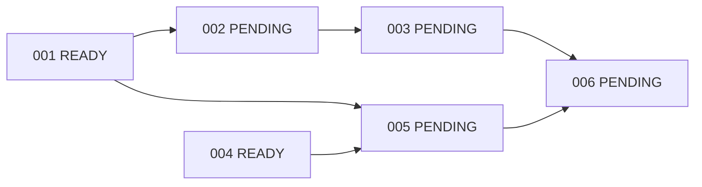

# Provider-Neutral Research Foundation — Implementation Plan

**Goal:** Replace distributed provider/model coupling with explicit composition
while preserving the current research workflow.
**Architecture:** Retain ADK/BaseLlm and LiteLLM, introduce validated local
settings and a thin model-error wrapper, extract normalized search into a
Tavily adapter behind one SearchPort.
**Tech stack:** Existing Python >=3.11, ADK, LiteLLM, Tavily, pytest/Ruff;
stdlib tomllib, dataclasses, typing, asyncio and ast. No new dependencies.
**Spec:** [requirements](requirements.md), [design](design.md).

Use the repository's single-packet Executor workflow. This planning session
implements none of these tasks. Do not create all branches, commit or integrate
automatically. The user's requested harness and locations govern this planning
session without changing the repository's Git rules.

## Global constraints

- One assigned current branch per packet, prepared by user from updated develop.
- Do not edit historical/new specs during execution or expand other packets.
- Keep exact prompts, existing public imports and existing assertion meanings.
- No live provider check is required for DONE; no keys/quota in automated tests.
- No new providers, dependencies, retries, fallbacks, agents or speculative ports.
- Every task: canonical baseline/final verification and scoped diff review.
- DONE is local verification. Promotion of dependents requires integrated
  prerequisite outputs in the intended develop base, not merely a DONE label.

## DAG and packet index

Statuses below are the planning snapshot; the individual packet and current
checkout govern later operational state. A dependent packet may be promoted
mechanically by its Executor when the workflow prerequisites are verified.
IDs 001 onward are future implementation IDs, not this session's ID.

| ID / Packet | Title | Status | Dependencies | Requirement IDs (PNRF-REQ-) | Expected result |
| --- | --- | --- | --- | --- | --- |
| [001](../../tasks/001-runtime-configuration.md) | Validated runtime configuration | READY | None | 002, 003, 013 | Immutable per-role settings, exact defaults, strict TOML loader and deterministic tests. |
| [002](../../tasks/002-model-runtime-boundary.md) | Model runtime and safe errors | PENDING | 001 | 004, 005, 012, 013 | Central Groq/LiteLLM factory, ADK-compatible passthrough and safe execution failures; old agents still work. |
| [003](../../tasks/003-agent-composition.md) | Configurable agent composition | PENDING | 002 | 001, 002, 003, 004, 009, 010, 012, 013 | Both role factories use settings/model seam; root imports, prompts, tool and budget preserved. |
| [004](../../tasks/004-search-capability-adapter.md) | Normalized search capability and Tavily adapter | READY | None | 006, 007, 008, 010, 013 | SearchPort/facade injection, moved Tavily logic, legacy client compatibility and constructor-safe errors. |
| [005](../../tasks/005-configured-search-routing.md) | Configured search routing | PENDING | 001, 004 | 003, 006, 007, 008, 009, 013 | Default facade selects configured search provider; safe configuration failure, explicit injection precedence. |
| [006](../../tasks/006-architecture-compatibility-gates.md) | Architecture and offline compatibility gates | PENDING | 003, 005 | 001, 002, 004, 006, 009, 010, 011, 012, 013, 014 | AST guards, offline composed compatibility and README operations/extension guidance. |

Recommended serial order: **001 -> 002 -> 004 -> checkpoint A -> 003 -> 005
-> 006 -> checkpoint B**. 004 may run first/independently on its own correctly
prepared branch, but 001 is the recommended initial handoff. No simultaneous
editing of a shared checkout is needed. 002 consumes config, 003 consumes model
runtime plus its integrated config prerequisite; 005 consumes config and the
search adapter; 006 consumes both migrated paths. Each packet names the exact
required outputs. No cycle and no temporary broken-import phase.

## Coverage audit

| Requirement | Implementing/protecting packets |
| --- | --- |
| PNRF-REQ-001 | 003, 006 |
| PNRF-REQ-002 | 001, 003, 006 |
| PNRF-REQ-003 | 001, 003, 005 |
| PNRF-REQ-004 | 002, 003, 006 |
| PNRF-REQ-005 | 002 |
| PNRF-REQ-006 | 004, 005, 006 |
| PNRF-REQ-007 | 004, 005 |
| PNRF-REQ-008 | 004, 005 |
| PNRF-REQ-009 | 003, 005, 006 |
| PNRF-REQ-010 | 003, 004, 006 |
| PNRF-REQ-011 | 006 |
| PNRF-REQ-012 | 002, 003, 006 |
| PNRF-REQ-013 | 001–006 |
| PNRF-REQ-014 | 006 |

## Selective High checkpoints

| Checkpoint | Timing | Review | Replanning signals |
| --- | --- | --- | --- |
| A — foundations | After 001, 002 and 004 are verified and integrated, before 003/005. | Config replacement/precedence, ADK-compatible model streaming/tool passthrough, safe error categories, SearchPort normalized contract, legacy path and unchanged source semantics. | ADK requires another response schema/wrapper, unsupported options are silently dropped, settings leak credentials, constructor errors escape, normalization changes, or agents need provider-specific branches. |
| B — completed foundation | After 006 and all dependencies are verified, before declaring feature ready for broader evolution/release. | Full dependency direction, offline composed flow, unchanged grounding/budget, per-role model swaps, README, scope and all acceptance records. | Guards miss actual coupling, adapters bypass public facade, nondefault model breaks tool contract, prompt/evidence rules weakened, or live APIs are necessary to pass tests. |

These are recommended user-controlled reviews, not Task IDs, automatic approval
ceremonies or High after each packet. Failed mechanical checks block the owning
packet; real contract changes return to Planner rather than being invented by
an Executor. Manual authorized provider smoke/evaluation may follow separately
and is not required to turn deterministic task acceptance green.

## Review focus and execution discipline

- Profile env set in a developer shell: tests clear/control it; imports should
  work offline without keys. Owned by 001/003/005/006.
- Partial stream then provider exception: terminal safe error, no replay or
  manufactured final answer. Owned by 002.
- SDK client construction failure: same typed retrieval error as request
  failure; no raw secret or empty success. Owned by 004.
- Explicit normalized searcher alongside legacy client: reject before either
  call; injected searcher/client bypass default profile. Owned by 004/005.
- Changed model/tool capability: retain full ADK responses and unchanged prompt
  constraints; mechanics green does not establish inference quality. 002/003/006.

Each packet gives concrete files/interfaces, a failing-test-first sequence,
targeted commands and observable acceptance. Executors write bodies using the
settled design; they do not choose transport, configuration format or future
capabilities. Never commit just because a generic skill suggests a commit step.
